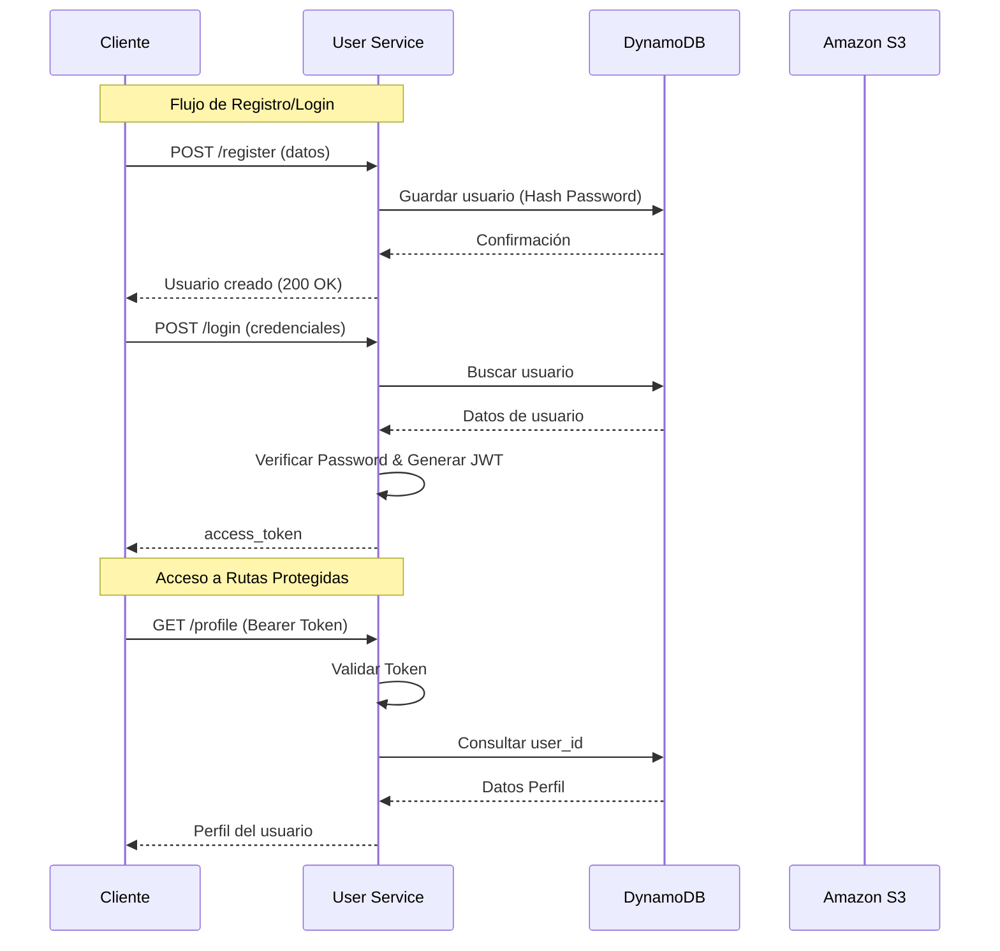

#  Bank User Service

Este es el microservicio central de **gestión de usuarios** para la plataforma de banca moderna. Ofrece capacidades robustas para el registro, autenticación, gestión de perfiles y carga de recursos multimedia (avatares), integrando servicios de AWS de manera nativa para alta escalabilidad y rendimiento.

##  Tecnologías Principales

- **[FastAPI](https://fastapi.tiangolo.com/):** Framework web moderno de Python, rápido (high-performance), fácil de aprender, rápido de programar y listo para producción.
- **[Python 3.10+](https://www.python.org/):** Lenguaje de programación base.
- **[AWS DynamoDB](https://aws.amazon.com/dynamodb/):** Base de datos NoSQL clave-valor y de documentos que ofrece rendimiento de milisegundos de un solo dígito a cualquier escala.
- **[AWS S3](https://aws.amazon.com/s3/):** Servicio de almacenamiento de objetos para el almacenamiento seguro de imágenes de perfil.
- **[AWS Lambda](https://aws.amazon.com/lambda/):** Servicio de computación sin servidor (Serverless) para tareas específicas y escalables.

---

##  Responsabilidades del Servicio

El **User Service** es responsable de las siguientes operaciones críticas:

1.  **Registro de Usuarios:** Creación de nuevas cuentas de usuario de forma segura.
2.  **Login / Autenticación:** Verificación de identidad y generación de tokens JWT.
3.  **Gestión de Perfil:** Actualización de información personal y preferencias del usuario.
4.  **Carga de Avatar:** Gestión de subida de imágenes de perfil directamente a S3.
5.  **Consulta de Perfil:** Obtención de información detallada del perfil de usuario de forma rápida.

---

##  Arquitectura y Estructura del Proyecto

A continuación se detalla la estructura base del repositorio, diseñada para seguir las mejores prácticas de modularidad y escalabilidad:

```text
bank-user-service
│
├── app                     # Núcleo de la aplicación FastAPI
│   ├── main.py             # Punto de entrada de la aplicación
│   ├── routes              # Definición de los endpoints API
│   │   └── user_routes.py
│   ├── services            # Lógica de negocio encapsulada
│   │   └── user_service.py
│   ├── models              # Definiciones de esquemas y modelos de datos
│   │   └── user_model.py
│   └── utils               # Utilidades y configuración de clientes (AWS, Seguridad)
│       ├── dynamodb.py     # Cliente para DynamoDB
│       ├── s3.py           # Cliente para AWS S3
│       └── jwt.py          # Lógica para manejo de tokens JWT
│
├── lambdas                 # Funciones Lambda para ejecución Serverless
│   ├── register_user.py
│   ├── login_user.py
│   ├── update_user.py
│   ├── upload_avatar.py
│   └── get_profile.py
│
├── requirements.txt        # Dependencias del proyecto
└── README.md               # Documentación técnica
```

---

##  Lambdas Implementadas

Este servicio utiliza las siguientes funciones Lambda para manejar tareas específicas fuera del flujo de FastAPI si es necesario (o integradas):

- `register-user-lambda`: Registro seguro de nuevos usuarios.
- `login-user-lambda`: Procesamiento de credenciales y autenticación.
- `update-user-lambda`: Modificación de datos existentes en DynamoDB.
- `upload-avatar-user-lambda`: Firma de URLs o procesamiento de imágenes para S3.
- `get-profile-user-lambda`: Recuperación rápida de perfiles de usuario.

---

##  Instalación y Uso

### 1. Configuración del Entorno Virtual
Crea y activa un entorno virtual para aislar las dependencias:

```bash
# Crear entorno virtual
python -m venv venv

# Activar en Windows
.\venv\Scripts\activate

# Activar en Linux/macOS
source venv/bin/activate
```

### 2. Instalación de Dependencias
Instala los paquetes necesarios listados en `requirements.txt`:

```bash
pip install -r requirements.txt
```

### 3. Configuración de Variables de Entorno
Asegúrate de tener un archivo `.env` en la raíz del proyecto con las siguientes variables:

```env
AWS_REGION=us-east-1
USERS_TABLE=bank-users
S3_BUCKET=bank-user-avatars
JWT_SECRET=tu_clave_secreta_aqui
```

### 4. Ejecución del Proyecto
Para probar el servicio localmente, utiliza `uvicorn`:

```bash
uvicorn app.main:app --reload
```

La API estará disponible en `http://127.0.0.1:8000`. Puedes acceder a la documentación interactiva en `http://127.0.0.1:8000/docs`.

---

##  Documentación de la API

### Endpoints Disponibles

| Método | Endpoint | Descripción | Requiere Auth |
| :--- | :--- | :--- | :---: |
| `POST` | `/users/register` | Registra un nuevo usuario con contraseña cifrada. | ❌ |
| `POST` | `/users/login` | Autentica al usuario y devuelve un token JWT. | ❌ |
| `GET` | `/users/all` | Lista todos los usuarios registrados en el sistema. | ❌ |
| `GET` | `/users/profile` | Obtiene el perfil completo del usuario autenticado. | ✅ |
| `POST` | `/users/avatar` | Sube un avatar a S3 y actualiza el perfil. | ✅ |
| `GET` | `/users/protected` | Ruta de prueba para verificar validez del token. | ✅ |

### Flujo de Autenticación

El sistema utiliza **JWT (Authentication Bearer)**. El flujo básico es:

1. El cliente envía credenciales a `/login`.
2. El servidor valida y responde con un `access_token`.
3. El cliente envía ese token en el header `Authorization: Bearer <token>` para rutas protegidas.



---

##  Seguridad y Mejores Prácticas

- Implementación de **JWT (JSON Web Tokens)** para una autenticación sin estado (stateless).
- Uso de **Variables de Entorno** para la configuración sensible.
- **Cifrado de datos** en reposo (DynamoDB/S3) y en tránsito (TLS/HTTPS).

---
*Desarrollado para Bank Service Platform.*
